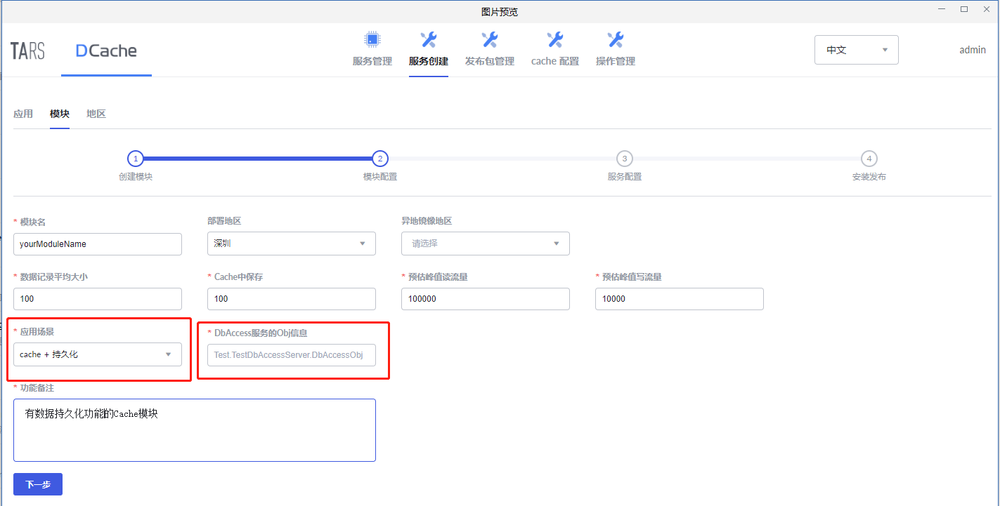
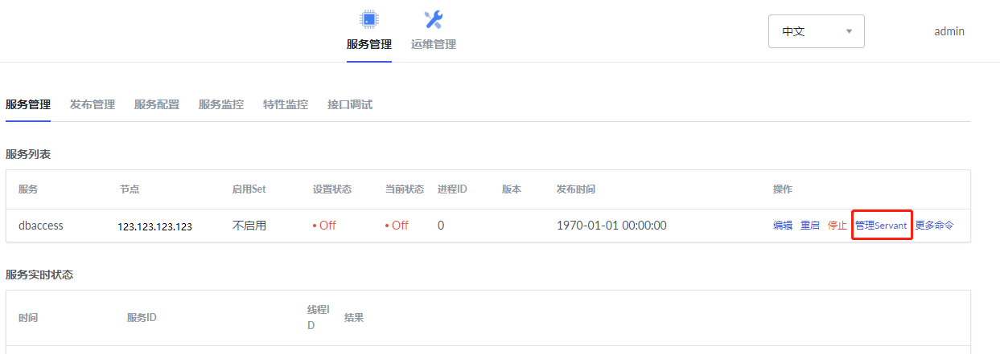
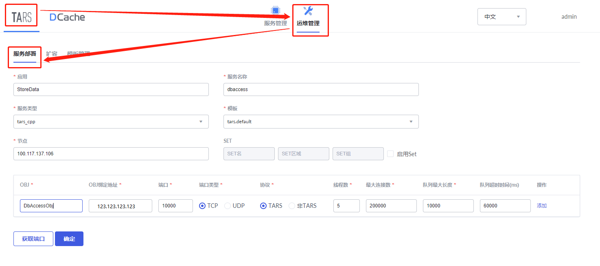
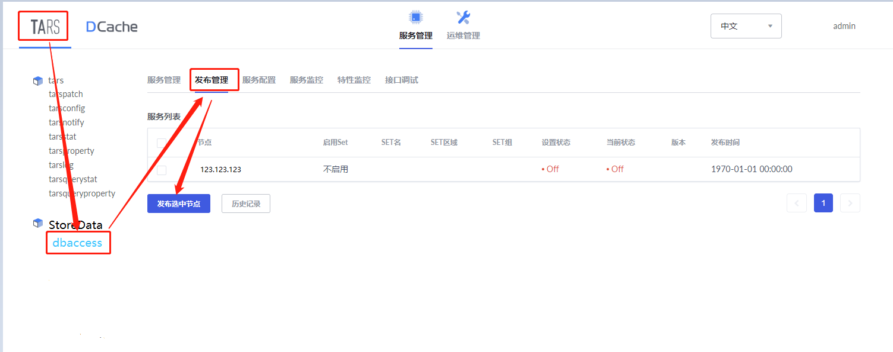

dbaccess是Cache访问持久化服务的代理服务，持久化服务可以是MySQL、SQL Server, PostgreSQL等关系型数据库，通过dbaccess服务，可以将内存数据保存到硬盘中。本篇文档的目标读者是有将内存数据永久保存需求的人。

下面以MySQL为例，展示如何实现内存数据持久化。

> * [提供DB实例和数据表](#1)
> * [开发一个基于tars的dbaccess服务](#2)
> * [相关配置](#3)
> * [部署dbaccess服务](#4)

##  1. 提供DB实例和数据表

**step1: 提供DB实例**

如果没有，请参考官方文档安装。

**step2：建表** 

一个模块对应一张表。

假设你有一个key-value模块，其中key是身份ID，value是地址信息，那么建表时就要创建3个字段：person_ID，person_Address，sDCacheExpireTime，其中字段“sDCacheExpireTime”是DCache要求增加的一个额外字段，表示过期时间。

假设你有一个k-k-row模块，其中主key是身份ID，联合key是课程ID，value是成绩，那么建表时就要指定4个字段：person_ID，course_ID，score，sDCacheExpireTime，其中字段“sDCacheExpireTime”是DCache要求增加的一个额外字段，表示过期时间。

##  2. 开发一个基于tars的dbaccess服务

dbaccess服务是DCache访问MySQL的代理，在dbaccess服务中通过访问MySQL从而实现数据的持久化。要求阅读本节的读者已经掌握开发一个tars服务的基本流程。

在DCache的源码中已经提供了一个简洁版的[dbaccess服务](https://github.com/Tencent/DCache/tree/master/src/DbAccess/example)，读者可参考并完善(接口声明文件[DbAccess.tars](https://github.com/Tencent/DCache/blob/master/src/DbAccess/example/DbAccess.tars)请勿修改)，然后编译生成发布包。

##  3. 相关配置

发布dbaccess服务前，需要作一些相应的配置，将Cache服务、dbaccess服务和MySQL实例整合成一个整体，从而实现数据持久化。

#### 3.1. 配置dbaccess服务
dbaccess服务的配置可参考库中的[DbAccess.conf文件](https://github.com/Tencent/DCache/blob/master/src/DbAccess/example/DbAccess.conf)，主要包括MySQL实例的用户名，密码和端口等信息。

#### 3.2. 配置Cache服务

配置Cache服务分两种场景：**新建模块**接入dbaccess和**已有模块**接入dbaccess。

##### 3.2.1 新模块接入dbaccess服务
在新建模块时，应用场景选择“cache + 持久化”，并填写相应的Obj信息，如下图所示：

ObjName可以通过点击“管理Servant”获取，如下图所示：

##### 3.2.2 已有模块接入dbaccess服务

修改Cache模块的Main/DbAccess 配置项：
1. DBFlag = Y, 
2. ReadDbFlag = Y, 
3. ObjName = StoreData.dbaccess.DbAccessObj

##  4. 部署dbaccess服务
生成dbaccess服务的发布包和做好相关配置后，就可以在tars管理平台部署该服务了。

**step1：** 服务部署

**step2：** 发布服务

上传在[开发一个基于tars的dbaccess服务](#2)生成的发布包。